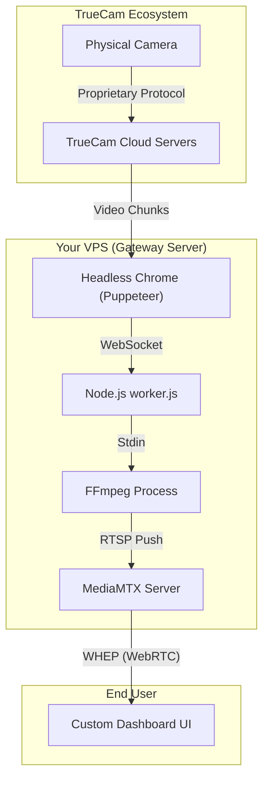

# TrueCam Gateway Architecture & Code Walkthrough

This document explains the end-to-end architecture of how live footage from the physical cameras makes its way to the custom dashboard, with references to the exact files and functions that power each step.

## System Diagram

## Step 1: Physical Camera to TrueCam Cloud
**Scope:** Outside of our system

When the physical camera is turned on, it doesn't stream directly to the VPS. Instead, it securely connects to TrueCam's proprietary cloud servers and streams the live video data there using its internal firmware. We have no direct access to this connection.

## Step 2: The Headless Browser (Puppeteer)
**File:** `gateway/worker.js`  
**Function:** `AccountPage.initPage()`

To access the proprietary video stream without an official API, the VPS runs a background script called `worker.js`. 
- `worker.js` creates an `AccountPage` instance for each TrueCam account email.
- It launches a hidden Google Chrome browser using `puppeteer` and navigates to the local SDK host (`http://localhost:8000/`).
- Using injected JavaScript (`this.page.evaluate`), it automatically logs into the TrueCam account by filling in the username and password fields.

## Step 3: Intercepting the Frames (The "Monkey Patch")
**File:** `gateway/worker.js`  
**Function:** `AccountPage.initPage()` (The Interceptor Injection)

Because TrueCam does not provide an RTSP stream natively, we have to extract the video manually. We do this by "monkey patching" the official TrueCam Web SDK (WASM module).
- We overwrite the SDK's internal drawing function: `window.ConnectApi.onrecvframeex`.
- When a raw H.264 or H.265 video chunk arrives from the cloud, our custom function intercepts it *before* it is drawn to the screen.
- It copies the raw frame data and sends it over a local WebSocket to our Node.js backend.
- Finally, it calls the original drawing function so the SDK thinks everything is normal and doesn't crash.

## Step 4: Routing Frames to Node.js
**File:** `gateway/worker.js`  
**Function:** `CameraBridge.setupWebSocketServer()` & `CameraBridge.connectCameraInPage()`

- **The Sender:** In `connectCameraInPage()`, a WebSocket is opened inside the hidden browser (`ws = new WebSocket(...)`). This is the channel the interceptor uses to send the stolen frames back home.
- **The Receiver:** In Node.js, `setupWebSocketServer()` spins up a local WebSocket listener. It acts as the catcher's mitt for every single incoming frame (`socket.on('message')`).

## Step 5: FFmpeg Creates the RTSP Stream
**File:** `gateway/worker.js`  
**Function:** `CameraBridge.startFfmpeg()`

Once Node.js receives the raw frames, they are immediately piped into FFmpeg.
- `startFfmpeg()` spawns an OS-level `ffmpeg` process with flags like `-c:v copy` to ensure the frames are repackaged into an RTSP stream without heavy CPU-intensive re-encoding.
- Node.js constantly writes the incoming WebSocket messages directly into FFmpeg's standard input: `this.ffmpegProcess.stdin.write(message)`.
- FFmpeg packages the data and outputs an RTSP stream to a local URL (e.g., `rtsp://127.0.0.1:8554/live/devcamera1_hd`).

## Step 6: MediaMTX Receives the RTSP Stream
**File:** `gateway/mediamtx.yml`

FFmpeg pushes the RTSP stream to **MediaMTX**, an open-source media server running as a background service on the VPS. MediaMTX requires zero custom code; it acts purely as a fast multiplexer, instantly translating the incoming RTSP stream into modern formats like WebRTC.

## Step 7: Dashboard Watches via WebRTC (WHEP)
**Files:** `dashboard_main/index.html` & `dashboard_main/reader.js`

Instead of relying on clunky, high-latency RTSP players, the custom dashboard uses WebRTC for ultra-low latency.
- `index.html` constructs a WHEP URL pointing to MediaMTX's WebRTC port (e.g., `http://168.144.84.199:8889/live/devcamera1_hd/whep`).
- `reader.js` uses the `MediaMTXWebRTCReader` class to establish a standard `RTCPeerConnection` (the same underlying technology powering Zoom and Google Meet) via an HTTP POST request.
- The browser binds the incoming WebRTC video track directly to the HTML `<video>` element, providing near-instantaneous live playback.

---

## Resilience & Auto-Recovery
**File:** `gateway/worker.js`

Because the system relies on intercepting closed ecosystems, it has several built-in self-healing mechanisms:
- **Frame Watchdog:** The WebSocket server checks the `idleTime` between frames. If 5 seconds pass with no frames (e.g., if the physical camera is turned off), the worker kills the FFmpeg process and initiates a reset.
- **SDK Reset:** To reconnect cleanly when a camera comes back online, `AccountPage.reloadPage()` completely closes the shared headless browser tab and recreates it. This flushes the TrueCam SDK's state and forces a clean connection.
- **Dynamic Polling:** A loop checks the database every 30 seconds for newly assigned cameras, automatically spawning new headless browser commands and FFmpeg pipelines in the background without requiring a server restart.
