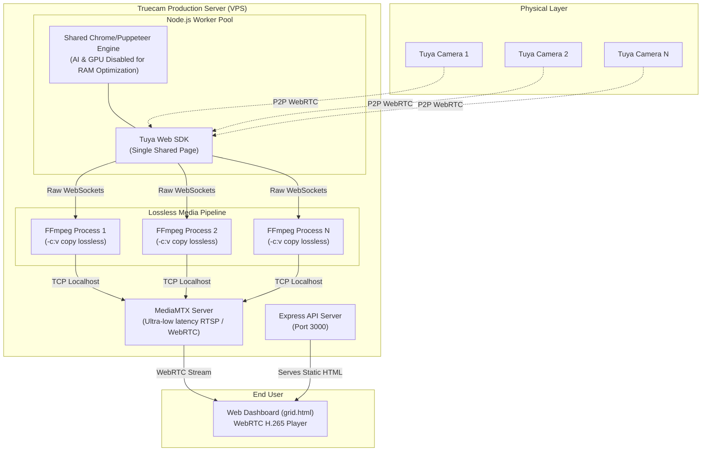

# Truecam Production Architecture

This document outlines the highly optimized, scalable production architecture for the Truecam gateway. It is designed to pull proprietary WebRTC streams from Tuya cameras and perfectly restream them at scale with near-zero latency and 100% preserved video quality.

## System Architecture Diagram

---

## Core Components

### 1. Shared Chrome/Puppeteer Engine (The Ingest Layer)
Because the cameras use proprietary P2P protocols, we must use the official Tuya Web SDK to pull the video. 
* **Production Optimization:** Instead of launching a heavy Chrome browser for every single camera (which would crash the server), we inject all cameras into a **single, shared browser page**. We also forcefully disabled Chrome's internal AI models (`OnDeviceModelService`) and Software GPUs to strip the memory footprint down to the absolute minimum.

### 2. Lossless Media Pipeline (The Processing Layer)
As raw video frames arrive from the cameras, they are immediately piped into independent FFmpeg processes.
* **Production Optimization:** We completely eliminated CPU-heavy video transcoding. FFmpeg uses a strict `-c:v copy` bypass to take the pristine, mathematically perfect H.265 (HEVC) frames from the camera and route them directly to the media server. This drops CPU usage to **near 0%** while retaining 100% of the original hardware quality.

### 3. MediaMTX (The Distribution Layer)
MediaMTX is an enterprise-grade Go-based media router. It receives the streams from FFmpeg and instantly broadcasts them to any number of end-users via ultra-low latency WebRTC or RTSP.

---

## Hardware & Scaling Recommendations

For a production deployment serving real clients, we recommend the following scaling tiers based on this optimized architecture:

> [!TIP]
> **Small Deployment (1 to 10 Cameras)**
> * **Server:** 2 vCPU / 2GB RAM
> * **Notes:** The shared Chrome browser takes about ~300MB as a baseline flat-tax. Each additional camera only adds ~30MB of RAM because of the lossless FFmpeg bypass.

> [!IMPORTANT]
> **Medium Deployment (10 to 50 Cameras)**
> * **Server:** 4 vCPU / 8GB RAM
> * **Notes:** The network bandwidth will become the primary bottleneck before CPU/RAM does. Ensure the VPS has a 1 Gbps or 10 Gbps network uplink to handle the constant incoming P2P video streams.

> [!NOTE]
> **Enterprise Scale (50+ Cameras)**
> * **Architecture:** Distribute the load using multiple `truecam-worker` instances spread across several VPS nodes. Use a central PostgreSQL database (instead of SQLite) and a Load Balancer to route users to the correct MediaMTX stream URL.
