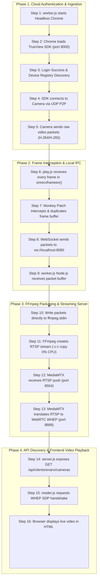

# TrueView Camera Gateway Architecture — 16-Step End-to-End Workflow Guide

This document presents an easy-to-understand, 16-step guide explaining how live camera feeds travel from physical TrueView 4G SIM cameras to the custom web dashboard HTML `<video>` element, mapping each step directly to the codebase.

---

## 📊 Complete Flow Overview (1-Line Summary)

```
Physical Camera ──► TrueView Cloud ──► Headless Chrome (worker.js) ──► play.js (onrecvframeex) 
      ──► Monkey Patch ──► WebSocket ──► worker.js Node.js ──► FFmpeg (-c:v copy) 
      ──► RTSP ──► MediaMTX ──► WHEP/WebRTC ──► reader.js ──► HTML <video> Stream
```

---

## 🔄 16-Step Step-by-Step Breakdown



---

### Step 1: worker.js starts Chrome
* **Action**: `worker.js` launches Google Chrome in `headless: "new"` mode (without opening a visible desktop window).
* **Code Reference**: [`gateway/worker.js`](file:///d:/enarxi/Cam/truecam/gateway/worker.js#L1040-L1076)
```javascript
browserInstance = await puppeteer.launch({
  headless: "new",
  args: ['--no-sandbox', '--disable-gpu', '--disable-web-security']
});
```
* **Why?** TrueView only allows camera access through its proprietary Web portal. There is no official RTSP endpoint. Puppeteer automates Chrome to behave like a human browser.

---

### Step 2: Chrome loads the SDK
* **Action**: Chrome opens `http://localhost:8000/`, loading local SDK static files served by Node.js.
* **Loaded Files**: [`play.js`](file:///d:/enarxi/Cam/truecam/sdk_dist/play.js), `connector.js`, `mqtt.js`, `decoder-pro.wasm`.
* **Code Reference**: [`gateway/worker.js`](file:///d:/enarxi/Cam/truecam/gateway/worker.js#L265)
```javascript
await page.goto('http://localhost:8000/', { waitUntil: 'networkidle2' });
```

---

### Step 3: Login Success
* **Action**: Puppeteer automatically fills in credentials (`info@enarxi.com` / `Camtest123@`) and clicks **Login**.
* **Code Reference**: [`gateway/worker.js`](file:///d:/enarxi/Cam/truecam/gateway/worker.js#L268-L285)
```javascript
await page.evaluate(async (acc, pwd) => {
  document.getElementById('login-account').value = acc;
  document.getElementById('login-password').value = pwd;
  document.getElementById('loginBtn').click();
});
```
* **Output**: Acquires `access_token` and fetches device list (Device UUID: `367ABDWN1000346168`).

---

### Step 4: SDK connects to Camera
* **Action**: The SDK initiates a secure P2P UDP tunnel connecting Chrome to the physical camera.
* **Code Reference**: [`gateway/worker.js`](file:///d:/enarxi/Cam/truecam/gateway/worker.js#L685-L715)
```javascript
window.ConnectApi.ConnectDevice(deviceId, deviceSecret);
```

---

### Step 5: Camera sends video
* **Action**: The physical camera streams compressed video packets (H.264 or H.265 Annex B packets) over the P2P connection into Chrome.
* **Why?** Sending compressed video packets uses significantly less bandwidth and memory than transmitting JPEG image sequences.

---

### Step 6: play.js receives every frame
* **Action**: As packets arrive in WebAssembly C++, `play.js` triggers the frame callback:
```javascript
window.ConnectApi.onrecvframeex(api_conn, frametype, data, datalen, ...)
```

---

### Step 7: Monkey Patch (Frame Interception)
* **Action**: We override `onrecvframeex` to copy the frame binary buffer and dispatch it to a WebSocket connection without breaking screen drawing.
* **Code Reference**: [`gateway/worker.js`](file:///d:/enarxi/Cam/truecam/gateway/worker.js#L327-L349)
```javascript
const original = window.ConnectApi.onrecvframeex;
window.ConnectApi.onrecvframeex = function (api_conn, frametype, data, ...) {
  if (frametype === 1 || frametype === 2) {
    const ws = window.__wsConnections[api_conn.deviceid];
    if (ws && ws.readyState === WebSocket.OPEN) {
      ws.send(data); // <--- COPY FRAME TO WEBSOCKET
    }
  }
  original.apply(this, arguments); // Call original function so SDK doesn't crash
};
```

---

### Step 8: WebSocket sends packets
* **Action**: Browser WebSocket client sends binary Uint8Array packets over local port `8080` to Node.js.
* **Code Reference**: [`gateway/worker.js`](file:///d:/enarxi/Cam/truecam/gateway/worker.js#L342)
```javascript
ws.send(data);
```

---

### Step 9: worker.js receives packets
* **Action**: Node.js WebSocket server captures incoming binary stream buffers.
* **Code Reference**: [`gateway/worker.js`](file:///d:/enarxi/Cam/truecam/gateway/worker.js#L499-L549)
```javascript
socket.on('message', (message) => {
  this.lastFrameTime = Date.now();
  // Pass frame packet forward
});
```

---

### Step 10: Send packets to FFmpeg
* **Action**: Node.js writes each packet directly into standard input (`stdin`) of an spawned FFmpeg process.
* **Code Reference**: [`gateway/worker.js`](file:///d:/enarxi/Cam/truecam/gateway/worker.js#L547-L549)
```javascript
if (this.ffmpegProcess && this.ffmpegProcess.stdin.writable) {
  this.ffmpegProcess.stdin.write(message);
}
```

---

### Step 11: FFmpeg creates RTSP
* **Action**: FFmpeg wraps raw packets into an RTSP stream using zero-CPU copy mode (`-c:v copy`).
* **Code Reference**: [`gateway/worker.js`](file:///d:/enarxi/Cam/truecam/gateway/worker.js#L574-L590)
```javascript
const ffmpegArgs = [
  '-i', 'pipe:0',
  '-c:v', 'copy', // Zero CPU Transcoding
  '-f', 'rtsp',
  '-rtsp_transport', 'tcp',
  'rtsp://127.0.0.1:8554/live/devcamera1_hd'
];
this.ffmpegProcess = spawn('ffmpeg', ffmpegArgs);
```

---

### Step 12: MediaMTX receives RTSP
* **Action**: MediaMTX ingests the RTSP push on TCP port `8554` (`rtsp://127.0.0.1:8554/live/devcamera1_hd`).
* **Why?** MediaMTX allows unlimited concurrent viewers to watch the stream without placing extra load on the camera.

---

### Step 13: MediaMTX converts RTSP to WebRTC (WHEP)
* **Action**: MediaMTX translates the incoming RTSP stream into WebRTC (WHEP protocol) on port `8889`:
`http://168.144.84.199:8889/live/devcamera1_hd/whep`

---

### Step 14: server.js (REST API Discovery)
* **Action**: REST API endpoint responds to clients with available cameras and their corresponding WHEP URLs.
* **Code Reference**: [`gateway/api/server.js`](file:///d:/enarxi/Cam/truecam/gateway/api/server.js#L58-L87)
```javascript
appMain.get('/api/clients/:clientId/cameras', authenticateClient, (req, res) => {
  res.json([{
    name: "Enarxi Cam 1",
    streamName: "devcamera1_hd",
    whepUrl: "http://168.144.84.199:8889/live/devcamera1_hd/whep"
  }]);
});
```

---

### Step 15: reader.js connects
* **Action**: Frontend WebRTC manager fetches camera metadata from `server.js` and creates an `RTCPeerConnection` SDP offer to the WHEP URL.
* **Code Reference**: [`dashboard_main/reader.js`](file:///d:/enarxi/Cam/truecam/dashboard_main/reader.js#L75-L120)
```javascript
const offer = await this.peerConnection.createOffer();
await this.peerConnection.setLocalDescription(offer);

const response = await fetch(whepUrl, {
  method: 'POST',
  headers: { 'Content-Type': 'application/sdp' },
  body: offer.sdp
});
```

---

### Step 16: Browser displays video
* **Action**: MediaMTX accepts SDP answer, establishes WebRTC connection, and binds incoming video track to HTML `<video>`.
* **Code Reference**: [`dashboard_main/reader.js`](file:///d:/enarxi/Cam/truecam/dashboard_main/reader.js#L60-L70)
```javascript
this.peerConnection.ontrack = (event) => {
  videoElement.srcObject = event.streams[0]; // Renders live low-latency stream
};
```
