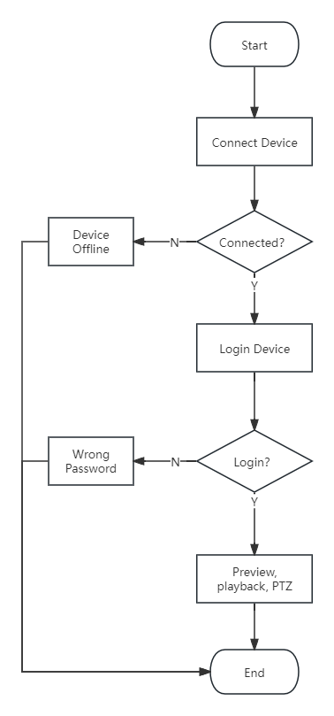

# H5SDK

## 1.SDK description

### File description

1. Files related to video decoding: `decoder_def.js`, `jadecoder.js`, `hevcdec.js`, `glutils.js`
2. Files related to device interaction: `connector.js`, `341.connector.js`, `433.connector.js`, `484.connector.js`, `612.connector.js`, and the `mqtt/` directory
3. The `play.js` and `index.html` files serve as demo presentations, encapsulating basic logic. For detailed function calls, please refer to these files.
4. In the demo, the JavaScript files under the js folder are third-party dependency libraries.

## 2.Device communication interface description

The device communication interface is agreed with the device communication interface and is used to connect devices, play videos, operate the device PTZ, etc.

### Device communication method

The SDK uses P2P SDK to communicate with the device and receive video streams. Currently, the WSS:// protocol is used. When the SDK sends instructions to the device, the device will return response information. To receive the response information, the callback function of each instruction needs to be predefined.

The SDK uses MQTT and devices for topic subscription and message delivery, and is used to operate and set properties on the device.

### Device connection mechanism

When using a device, you need to connect the device first, and then log in to the device after the connection is successful to perform operations such as video playback, video retrieval, and PTZ control.

### Device connection process



### Glossary

| Name             | Description                                                                                                       |
| ---------------- | ----------------------------------------------------------------------------------------------------------------- |
| Device IP        | The IP of the device in the LAN, you can connect the device through the IP LAN                                    |
| Device port      | The port number of the device when using IP connection, default 10000                                             |
| Device user name | The user name required to log in to the device, the default is admin                                              |
| Device password  | The password required to log in to the device, the default is empty                                               |
| Channel          | The number of channels of the device, starting from 0. Single-channel devices, i.e. cameras, only have channel 0. |

### Dictionary value

| Dictionary type                | Dictionary value                                                                                                                                                                                                                                       |
| ------------------------------ | ------------------------------------------------------------------------------------------------------------------------------------------------------------------------------------------------------------------------------------------------------ |
| Encoding mode enc              | H264 `<br>` H265                                                                                                                                                                                                                                     |
| Frame type frametype           | 0 Audio frame `<br>`1 I frame `<br>`2 P frame                                                                                                                                                                                                      |
| Stream type streamid           | 0 Sub stream `<br>`1 Main stream                                                                                                                                                                                                                     |
| Frame rate fps                 | 1-25                                                                                                                                                                                                                                                   |
| P2P connection error code code | 0 Success `<br>` -2 Time out `<br>` -10 Local connection closed `<br>` -11 Remote connection closed `<br>` -12 Addressing failed `<br>` -13 Connection failed (Device offline)`<br>` -20 Login device verification failed (Wrong password) |
| Video type                     | Timing:1 `<br>`Move:2 `<br>`Alarm:4 `<br>`Manual:8 `<br>`All types: 15, 15 is used when retrieving videos                                                                                                                                      |

## 3.P2P SDK

### Connect devices

#### Method description

| Serial number | Method name   | Method description                                         | Call object |
| ------------- | ------------- | ---------------------------------------------------------- | ----------- |
| 1             | ConnectDevice | Connect device method, send connection device instructions | Player      |

#### Call method

Call example

```js
Player.ConnectDevice(deviceid, ip, user, pwd, winindex, port, connectType, channel, streamid,wss,cb)
```

Parameter Description

| Serial number | Parameter name | Parameter Type | illustrate                                                                                                                                            |
| ------------- | -------------- | -------------- | ----------------------------------------------------------------------------------------------------------------------------------------------------- |
| 1             | deviceid       | String         | Device ID                                                                                                                                             |
| 2             | ip             | String         | Device IP, the device ID is used first to connect. If there is no device ID, the IP connection is used. If there is an ID, it is allowed to be empty. |
| 3             | user           | String         | Device username                                                                                                                                       |
| 4             | pwd            | String         | Device password                                                                                                                                       |
| 5             | winindex       | Number         | Join index                                                                                                                                            |
| 6             | port           | Number         | Used when connecting via IP, it is recommended to use port 10000                                                                                      |
| 7             | connectType    | Number         | Connection method 0: Pre-connection 1: Connect and open the stream                                                                                    |
| 8             | channel        | Number         | channel                                                                                                                                               |
| 9             | streamid       | Number         | Code stream type, valid when the connection mode is 1                                                                                                 |
| 10            | wss            | String         | Protocol type,'wss'/'ws'                                                                                                                              |
| 11            | cb             | Function       | The callback function is addressed to fetch the MQTT connection address.                                                                              |

### Log into device

#### Method description

| Serial number | Method name | Method description                                                    | Call object |
| ------------- | ----------- | --------------------------------------------------------------------- | ----------- |
| 1             | login       | Instructions sent after successful connection to log in to the device | Player      |

#### Call method

Call example

```js
ConnectApi.login(session, username, password);
```

Parameter Description

| Serial number | parameter name | Parameter Type | illustrate        |
| ------------- | -------------- | -------------- | ----------------- |
| 1             | session        | String         | connection object |
| 2             | username       | String         | Device username   |
| 3             | password       | String         | Device password   |

### Open code stream

#### Method description

| Serial number | Method name | Method description                                                       | Call object |
| ------------- | ----------- | ------------------------------------------------------------------------ | ----------- |
| 1             | OpenStream  | Opening the device stream will trigger a real-time video stream callback | Player      |

#### Call method

Call example

```js
Player.OpenStream(deviceid, ip, channel, streamid, winindex)
```

Parameter Description

| Serial number | parameter name | Parameter Type | illustrate          |
| ------------- | -------------- | -------------- | ------------------- |
| 1             | deviceid       | String         | Device ID           |
| 2             | ip             | String         | Device IP           |
| 3             | channel        | Number         | Channel             |
| 4             | streamid       | Number         | Stream type         |
| 5             | winindex       | Number         | Rendered form index |

### Close code stream

#### Method description

| Serial number | Method name | Method description  | Call object |
| ------------- | ----------- | ------------------- | ----------- |
| 1             | CloseStream | Close device stream | Player      |

#### Call method

Call example

```js
Player.CloseStream(keyindex)
```

Parameter Description

| Serial number | parameter name | Parameter Type | illustrate   |
| ------------- | -------------- | -------------- | ------------ |
| 1             | keyindex       | Number         | Window index |

### Switch code stream

#### Method description

| Serial number | Method name  | Method description        | Call object |
| ------------- | ------------ | ------------------------- | ----------- |
| 1             | ChangeStream | Switch device code stream | Player      |

#### Call method

Call example

```js
Player.ChangeStream(deviceid, ip, channel, streamid, winindex)
```

Parameter Description

| Serial number | parameter name | Parameter Type | illustrate                     |
| ------------- | -------------- | -------------- | ------------------------------ |
| 1             | deviceid       | String         | Device ID                      |
| 2             | ip             | String         | Device IP                      |
| 3             | channel        | Number         | Channel                        |
| 4             | streamid       | Number         | To switch the code stream type |
| 5             | winindex       | Number         | Rendered form index            |

### Disconnect device

#### Method description

| Serial number | Method name      | Method description | Call object |
| ------------- | ---------------- | ------------------ | ----------- |
| 1             | DisConnectDevice | Disconnect device  | Player      |

#### Call method

Call example

```js
Player.DisConnectDevice(deviceid, ip)
```

Parameter Description

| Serial number | parameter name | Parameter Type | illustrate |
| ------------- | -------------- | -------------- | ---------- |
| 1             | deviceid       | String         | Device ID  |
| 2             | ip             | String         | Device IP  |

### Video playback search

#### Method description

| Serial number | Method name  | Method description                                                                                                                                                                                               | Call object |
| ------------- | ------------ | ---------------------------------------------------------------------------------------------------------------------------------------------------------------------------------------------------------------- | ----------- |
| 1             | SreachRecord | Query the specified channel recording of the device. Note that it cannot be executed twice at the same time. The caller should be careful to prevent the user from performing other operations during the query. | Player      |

#### Call method

Call example

```js
Player.SreachRecord(deviceid, ip, channel, begintime, endtime, type)
```

Parameter Description

| Serial number | parameter name | Parameter Type | illustrate                                                           |
| ------------- | -------------- | -------------- | -------------------------------------------------------------------- |
| 1             | deviceid       | String         | Device ID                                                            |
| 2             | ip             | String         | Device IP                                                            |
| 3             | channel        | String         | Channel                                                              |
| 4             | begintime      | String         | Start time Second-level timestamp                                    |
| 5             | endtime        | String         | End time Second level timestamp                                      |
| 6             | type           | String         | Recording type, timing: 1 moving: 2 alarm: 4 manual: 8 all types: 15 |

### Stop recording query

#### Method description

| Serial number | Method name | Method description   | Call object |
| ------------- | ----------- | -------------------- | ----------- |
| 1             | Stopsearch  | Stop recording query | Player      |

#### Call method

Call example

```js
Player.Stopsearch(deviceid, ip)
```

Parameter Description

| Serial number | parameter name | Parameter Type | illustrate |
| ------------- | -------------- | -------------- | ---------- |
| 1             | deviceid       | String         | Device ID  |
| 2             | ip             | String         | Device IP  |

### Start video playback

#### Method description

| Serial number | Method name   | Method description                            | Call object |
| ------------- | ------------- | --------------------------------------------- | ----------- |
| 1             | StartPlayBack | Play back the video at a specified time point | Player      |

#### Call method

Call example

```js
Player.StartPlayBack(deviceid, ip, channel, begintime, endtime, type, winindex, isSound)
```

Parameter Description

| Serial number | parameter name | Parameter Type | illustrate                                                                       |
| ------------- | -------------- | -------------- | -------------------------------------------------------------------------------- |
| 1             | deviceid       | String         | Device ID                                                                        |
| 2             | ip             | String         | Device IP                                                                        |
| 3             | channel        | String         | Channel                                                                          |
| 4             | begintime      | String         | Recording start time Second-level timestamp                                      |
| 5             | endtime        | String         | Recording end time Second-level timestamp                                        |
| 6             | type           | String         | Recording type, timing: 1 moving: 2 alarm: 4 manual: 8 all types: 15             |
| 7             | winindex       | String         | Form index                                                                       |
| 8             | isSound        | String         | Whether to play audio, a field encapsulated by business logic, may not be passed |

### Pause playback

#### Method description

| Serial number | Method name   | Method description     | Call object |
| ------------- | ------------- | ---------------------- | ----------- |
| 1             | PausePlayBack | Pause current playback | Player      |

#### Call method

Call example

```js
Player.PausePlayBack(deviceid, ip)
```

Parameter Description

| Serial number | parameter name | Parameter Type | illustrate |
| ------------- | -------------- | -------------- | ---------- |
| 1             | deviceid       | String         | Device ID  |
| 2             | ip             | String         | Device IP  |

### Continue playback

#### Method description

| Serial number | Method name      | Method description        | Call object |
| ------------- | ---------------- | ------------------------- | ----------- |
| 1             | ContinuePlayBack | Continue current playback | Player      |

#### Call method

Call example

```js
Player.ContinuePlayBack(deviceid, ip)
```

Parameter Description

| Serial number | parameter name | Parameter Type | illustrate |
| ------------- | -------------- | -------------- | ---------- |
| 1             | deviceid       | String         | Device ID  |
| 2             | ip             | String         | Device IP  |

### Stop playback

#### Method description

| Serial number | Method name      | Method description    | Call object |
| ------------- | ---------------- | --------------------- | ----------- |
| 1             | ContinuePlayBack | Stop current playback | Player      |

#### Call method

Call example

```js
Player.StopPlayBack(deviceid, ip, channel)
```

Parameter Description

| Serial number | parameter name | Parameter Type | illustrate |
| ------------- | -------------- | -------------- | ---------- |
| 1             | deviceid       | String         | Device ID  |
| 2             | ip             | String         | Device IP  |
| 3             | channel        | String         | Channel    |

### Player initialization

#### Method description

| Serial number | Method name | Method description                                                                                                                   | Call object |
| ------------- | ----------- | ------------------------------------------------------------------------------------------------------------------------------------ | ----------- |
| 1             | init        | Player initialization, pass in the array of canvas elements, such as 4 windows, pass in the array containing these 4 canvas elements | Player      |

#### Call method

Call example

```js
Player.init(playerArr)
```

Parameter Description

| Serial number | parameter name | Parameter Type | illustrate   |
| ------------- | -------------- | -------------- | ------------ |
| 1             | playerArr      | Array          | Canvas array |

### Screenshot

#### Method description

| Serial number | Method name | Method description              | Call object |
| ------------- | ----------- | ------------------------------- | ----------- |
| 1             | Snapshot    | Take a screenshot of the screen | Player      |

#### Call method

Call example

```js
Player.Snapshot(winindex, mode, name, width, height, callback)
```

Parameter Description

| Serial number | parameter name | Parameter Type | illustrate                                                                                                                                                                                        |
| ------------- | -------------- | -------------- | ------------------------------------------------------------------------------------------------------------------------------------------------------------------------------------------------- |
| 1             | winindex       | Number         | Form index value, required                                                                                                                                                                        |
| 2             | mode           | Number         | Screenshot method 0: Use the canvas of the specified window to take a screenshot 1: Use the next frame of code stream data in the specified window to take a screenshot                           |
| 3             | name           | String         | File name, needs to have format, currently supports png and jpg, default value: snapshot.png                                                                                                      |
| 4             | width          | Number         | If the width of the generated image is passed empty, the canvas width or code stream width will be used according to the screenshot method. It needs to be passed together with the image height. |
| 5             | height         | Number         | If the generated image height is passed empty, the canvas height or code stream height will be used according to the screenshot method. It needs to be passed together with the image width.      |
| 6             | callback       | Function       | Screenshot callback. When image data is needed, it is obtained through the callback. The image is not downloaded. By default, the image is downloaded directly by default.                        |

### Start intercom

#### Method description

| Serial number | Method name | Method description                                        | Call object |
| ------------- | ----------- | --------------------------------------------------------- | ----------- |
| 1             | OpenCall    | Initiate intercom and have voice intercom with the device | Player      |

#### Call method

Call example

```js
Player.OpenCall(deviceid, ip, channel)
```

Parameter Description

| Serial number | parameter name | Parameter Type | illustrate |
| ------------- | -------------- | -------------- | ---------- |
| 1             | deviceid       | String         | Device ID  |
| 2             | ip             | String         | Device IP  |
| 3             | channel        | Array          | Channel    |

### Transmit intercom audio

#### Method description

| Serial number | Method name | Method description                                                                         | Call object |
| ------------- | ----------- | ------------------------------------------------------------------------------------------ | ----------- |
| 1             | CallSend    | After the intercom is successfully initiated, real-time audio is transmitted to the device | Player      |

#### Call method

Call example

```js
Player.CallSend(deviceid, ip, channel, time_stamp, enc, sample_rate, sample_width, channels, compress_ratio, voice_data, voice_data_size)
```

Parameter Description

| Serial number | parameter name  | Parameter Type | illustrate |
| ------------- | --------------- | -------------- | ---------- |
| 1             | deviceid        | String         | Device ID  |
| 2             | ip              | String         | Device IP  |
| 3             | channel         | Number         | Channel    |
| 4             | time_stamp      | Number         | Device ID  |
| 5             | enc             | String         | Device IP  |
| 6             | sample_rate     | String         | Channel    |
| 7             | sample_width    | Number         | Device ID  |
| 8             | channels        | Number         | Device IP  |
| 9             | compress_ratio  | Number         | Channel    |
| 10            | voice_data      | Uint8Array     | Device IP  |
| 11            | voice_data_size | Number         | Channel    |

### Turn off intercom

#### Method description

| Serial number | Method name | Method description                                                                         | Call object |
| ------------- | ----------- | ------------------------------------------------------------------------------------------ | ----------- |
| 1             | CallHangup  | After the intercom is successfully initiated, real-time audio is transmitted to the device | Player      |

#### Call method

Call example

```js
Player.CallHangup(deviceid, ip, channel)
```

Parameter Description

| Serial number | parameter name | Parameter Type | illustrate |
| ------------- | -------------- | -------------- | ---------- |
| 1             | deviceid       | String         | Device ID  |
| 2             | ip             | String         | Device IP  |
| 3             | channel        | Number         | Channel    |

### Connection callback

#### Method description

| Serial number | Method name | Method description                                                                | Call object |
| ------------- | ----------- | --------------------------------------------------------------------------------- | ----------- |
| 1             | onconnect   | Device connection callback, response callback after calling the connection method | ConnectApi  |

#### Callback parameters

Callback example

```js
ConnectApi.onconnect = function (session, code) {
   	if (code === 0) {
   		ConnectApi.login(session, session.user, session.pwd);
   	}
};
```

Parameter Description

| Serial number | parameter name | Parameter Type                                                                    | illustrate                                                                                                                                              |
| ------------- | -------------- | --------------------------------------------------------------------------------- | ------------------------------------------------------------------------------------------------------------------------------------------------------- |
| 1             | session        | Object                                                                            | ConnectApi                                                                                                                                              |
| 2             | code           | Device connection callback, response callback after calling the connection method | Status code to determine whether the connection is successful or failed. 0 is success, others are failure. Failure may mean that the device is offline. |

### Login callback

#### Method description

| Serial number | Method name   | Method description                                                      | Call object |
| ------------- | ------------- | ----------------------------------------------------------------------- | ----------- |
| 1             | onloginresult | Device login callback, response callback after calling the login method | ConnectApi  |

#### Callback parameters

Callback example

```js
ConnectApi.onloginresult= function (session, code) {
};
```

Parameter Description

| Serial number | parameter name | Parameter Type                                                                    | illustrate                                                                                                                                                        |
| ------------- | -------------- | --------------------------------------------------------------------------------- | ----------------------------------------------------------------------------------------------------------------------------------------------------------------- |
| 1             | session        | Object                                                                            | ConnectApi                                                                                                                                                        |
| 2             | code           | Device connection callback, response callback after calling the connection method | Status code, used to determine whether login is successful or failed. 0 means success, others means failure. Failure means the username or password is incorrect. |

### Disconnect callback

#### Method description

| Serial number | Method name  | Method description                                                                                                                                          | Call object |
| ------------- | ------------ | ----------------------------------------------------------------------------------------------------------------------------------------------------------- | ----------- |
| 1             | ondisconnect | The callback when the device connection is disconnected, the callback triggered when the device is passively disconnected due to network and other reasons. | ConnectApi  |

#### Callback parameters

Callback example

```js
ConnectApi.ondisconnect= function (session, code) {
};
```

Parameter Description

| Serial number | parameter name | Parameter Type | illustrate        |
| ------------- | -------------- | -------------- | ----------------- |
| 1             | session        | Object         | Connection object |
| 2             | code           | Number         | Status code       |

### Open code stream callback

#### Method description

| Serial number | Method name  | Method description                                                                                    | Call object |
| ------------- | ------------ | ----------------------------------------------------------------------------------------------------- | ----------- |
| 1             | onopenstream | Open the device code stream callback, the response callback after calling the open code stream method | ConnectApi  |

#### Callback parameters

Callback example

```js
ConnectApi.onopenstream= function (session, channel, streamid, result, cam_desc) {
   
};
```

Parameter Description

| Serial number | parameter name | Parameter Type | illustrate                                                 |
| ------------- | -------------- | -------------- | ---------------------------------------------------------- |
| 1             | session        | Object         | Connection object                                          |
| 2             | channel        | Number         | Channel, open the channel corresponding to the code stream |
| 3             | streamid       | Number         | Code stream value                                          |
| 4             | code           | Number         | Status code, 0 means success, others means failure         |

### Live video streaming callback

#### Method description

| Serial number | Method name   | Method description                                            | Call object |
| ------------- | ------------- | ------------------------------------------------------------- | ----------- |
| 1             | onrecvframeex | Callback method after sending the code stream opening command | ConnectApi  |

#### Callback parameters

Callback example

```js
ConnectApi.onrecvframeex=function (session, frametype, data, datalen, channel, width, height, enc, fps, timestamp) {
   
};
```

Parameter Description

| Serial number | parameter name | Parameter Type | illustrate                                                                |
| ------------- | -------------- | -------------- | ------------------------------------------------------------------------- |
| 1             | session        | Object         | Connection object                                                         |
| 2             | frametype      | Number         | Frame Type `<br>`0 audio frames `<br>` 1 I frames `<br>` 2 P frames |
| 3             | data           | Buffer         | Video frame data                                                          |
| 4             | datalen        | Number         | Video data length                                                         |
| 5             | channel        | Number         | Channel value                                                             |
| 6             | width          | Number         | Screen width                                                              |
| 7             | height         | Number         | Screen height                                                             |
| 8             | enc            | Number         | Encoding format                                                           |
| 9             | fps            | Number         | Frame rate                                                                |
| 10            | timestamp      | Number         | The timestamp of this frame                                               |

### Playback video stream callback

#### Method description

| Serial number | Method name    | Method description                                         | Call object |
| ------------- | -------------- | ---------------------------------------------------------- | ----------- |
| 1             | onrecvrecframe | Callback method after sending the command to open playback | ConnectApi  |

#### Callback parameters

Callback example

```js
ConnectApi.onrecvrecframe = function (session, frametype, data, datalen, channel, width, height, enc, fps, ts_ms)){
  
}
```

Parameter Description

| Serial number | parameter name | Parameter Type | illustrate                                            |
| ------------- | -------------- | -------------- | ----------------------------------------------------- |
| 1             | session        | Object         | Connection object                                     |
| 2             | frametype      | Number         | Frame Type ``0 audio frames`` 1 I frames`` 2 P frames |
| 3             | data           | Buffer         | Video frame data                                      |
| 4             | datalen        | Number         | Video data length                                     |
| 5             | channel        | Number         | Channel value                                         |
| 6             | width          | Number         | Screen width                                          |
| 7             | height         | Number         | Screen height                                         |
| 8             | enc            | Number         | Encoding format                                       |
| 9             | fps            | Number         | Frame rate                                            |
| 10            | timestamp      | Number         | The timestamp of this frame                           |

### Query playback return data callback

#### Method description

| Serial number | Method name | Method description                                       | Call object |
| ------------- | ----------- | -------------------------------------------------------- | ----------- |
| 1             | onsearchrec | Callback method after sending playback retrieval command | ConnectApi  |

#### Callback parameters

Callback example

```js
ConnectApi.onsearchrec = function (session, channel, file_type, file_begintime, file_endtime, file_total){
  
}
```

Parameter Description

| Serial number | parameter name | Parameter Type | illustrate                                             |
| ------------- | -------------- | -------------- | ------------------------------------------------------ |
| 1             | session        | Object         | Connection object                                      |
| 2             | channel        | Number         | Channel value                                          |
| 3             | file_type      | Number         | Recording type, timing: 1 moving: 2 alarm: 4 manual: 8 |
| 4             | file_begintime | Number         | Recording start time                                   |
| 5             | file_endtime   | String         | Recording end time                                     |
| 6             | file_total     | Number         | Retrieve the total number of videos                    |

### Playback retrieval end callback

#### Method description

| Serial number | Method name    | Method description                                                    | Call object |
| ------------- | -------------- | --------------------------------------------------------------------- | ----------- |
| 1             | onsearchrecend | Callback method triggered after playback video retrieval is completed | ConnectApi  |

#### Callback parameters

Callback example

```js
ConnectApi.onsearchrecend= function (session){
  
}
```

Parameter Description

| Serial number | parameter name | Parameter Type | illustrate        |
| ------------- | -------------- | -------------- | ----------------- |
| 1             | session        | Object         | Connection object |

### P2P error callback

#### Method description

| Serial number | Method name | Method description                        | Call object |
| ------------- | ----------- | ----------------------------------------- | ----------- |
| 1             | onp2perror  | Callback when P2P connection error occurs | ConnectApi  |

#### Callback parameters

Callback example

```js
ConnectApi.onp2perror= function (session, code){
  
}
```

Parameter Description

| Serial number | parameter name | Parameter Type | illustrate        |
| ------------- | -------------- | -------------- | ----------------- |
| 1             | session        | Object         | Connection object |
| 2             | code           | Number         | Error code        |

### Intercom callback

#### Method description

| Serial number | Method name       | Method description            | Call object |
| ------------- | ----------------- | ----------------------------- | ----------- |
| 1             | onvop2pcallresult | Callback to initiate intercom | ConnectApi  |

#### Callback parameters

Callback example

```js
ConnectApi.onvop2pcallresult= function (session, code){
  
}
```

Parameter Description

| Serial number | parameter name | Parameter Type | illustrate        |
| ------------- | -------------- | -------------- | ----------------- |
| 1             | session        | Object         | Connection object |
| 2             | code           | Number         | Error code        |

## 4.MQTT

1.MQTT business is mainly completed by calling MqttClient and MqttAction. MqttClient provides connection, disconnection, subscription and message publishing operations; MqttAction provides message publishing and subscription callback parameter acquisition.

2.Subsequent operations can only be carried out after a successful mqtt connection.

3.You need to log in before retrieving the device capability set, and the retrieval can only be performed after a successful login. Once the retrieval is successful, you can call MqttAction.getDeviceProperty to obtain the value of the property based on the funCode and funId returned by the interface. For device setting, you can refer to the DevceSetting.md document for the value. The type shall be the funContent.typeSpec.type in the device capability set, after which you can call MqttAction.setDeviceProperty to perform the setting. Please refer to the calling examples for details.

### Login

#### Method description

| Serial number | Method name | Method description | Call object |
| ------------- | ----------- | ------------------ | ----------- |
| 1             | userLogin   | user login         | ConnectApi  |

#### Call method

Call example

```js
ConnectApi.userLogin(account, password)
```

Parameter Description

| Serial number | parameter name | Parameter Type | illustrate      |
| ------------- | -------------- | -------------- | --------------- |
| 1             | account        | String         | user's account  |
| 2             | password       | String         | user's password |

### Get deviceList

#### Method description

| Serial number | Method name   | Method description | Call object |
| ------------- | ------------- | ------------------ | ----------- |
| 1             | getDeviceList | get deviceList     | ConnectApi  |

#### Call method

Call example

```js
ConnectApi.getDeviceList()
```

### Get device capability set

#### Method description

| Serial number | Method name    | Method description        | Call object |
| ------------- | -------------- | ------------------------- | ----------- |
| 1             | getDeviceModal | get device capability set | ConnectApi  |

#### Call method

Call example

```js
ConnectApi.getDeviceModal(devId)
```

Parameter Description

| Serial number | parameter name | Parameter Type | illustrate |
| ------------- | -------------- | -------------- | ---------- |
| 1             | devId          | String         | Device ID  |

### Connect devices

#### Method description

| Serial number | Method name   | Method description | Call object |
| ------------- | ------------- | ------------------ | ----------- |
| 1             | connectClient | Client connection  | MqttClient  |

#### Call method

Call example

```js
MqttClient.connectClient(deviceId, deviceSecret, url, port, callback)
```

Parameter Description

| Serial number | parameter name | Parameter Type | illustrate                                                          |
| ------------- | -------------- | -------------- | ------------------------------------------------------------------- |
| 1             | deviceId       | String         | Device ID                                                           |
| 2             | deviceSecret   | String         | Obtained from the user system device list                           |
| 3             | url            | String         | MQTT connection address, P2P connection device callback acquisition |
| 4             | port           | String         | MQTT connection address, P2P connection device callback acquisition |
| 5             | callback       | Function       | Callback function after calling                                     |

### Disconnect

#### Method description

| Serial number | Method name | Method description | Call object |
| ------------- | ----------- | ------------------ | ----------- |
| 1             | closeClient | Client disconnects | MqttClient  |

#### Call method

Call example

```js
MqttClient.closeClient(deviceId)
```

Parameter Description

| Serial number | parameter name | Parameter Type | illustrate |
| ------------- | -------------- | -------------- | ---------- |
| 1             | deviceId       | String         | Device ID  |

#### Call method

Call example

```js
MqttAction.getDeviceModel(deviceId, deviceSecret)
```

Parameter Description

| Serial number | parameter name | Parameter Type | illustrate                                |
| ------------- | -------------- | -------------- | ----------------------------------------- |
| 1             | deviceId       | String         | Device ID                                 |
| 2             | deviceSecret   | String         | Obtained from the user system device list |

### Get device properties

#### Method description

| Serial number | Method name       | Method description    | Call object |
| ------------- | ----------------- | --------------------- | ----------- |
| 1             | getDeviceProperty | Get device properties | MqttAction  |

#### Call method

```js
MqttAction.getDeviceProperty(deviceId, deviceSecret, properties, callback)
```

Call example

| Serial number | parameter name            | Parameter Type | illustrate                                                |
| ------------- | ------------------------- | -------------- | --------------------------------------------------------- |
| 1             | deviceId                  | String         |                                                           |
| 2             | properties                | Array          |                                                           |
|               | properties[].propertyName | String         | Referencing the funCode returned by getProductObjectModel |
|               | properties[].id           | Number         | Referencing the funCode returned by getProductObjectModel |
| 3             | callback                  | function       | Callback function after calling                           |

### Set device properties

#### Method description

| Serial number | Method name       | Method description    | Call object |
| ------------- | ----------------- | --------------------- | ----------- |
| 1             | setDeviceProperty | Set device properties | MqttAction  |

#### Call method

Call example

```js
MqttAction.setDeviceProperty(deviceId, properties, callback)
```

Parameter Description

| Serial number | parameter name            | Parameter Type | illustrate                                                                     |
| ------------- | ------------------------- | -------------- | ------------------------------------------------------------------------------ |
| 1             | deviceId                  | String         | Device ID                                                                      |
| 2             | properties                | Array          | Action command data issued                                                     |
|               | properties[].propertyName | String         | Property name                                                                  |
|               | properties[].id           | Number         | Attribute ID; corresponds to attribute name                                    |
|               | properties[].type         | Number         | Type of data;1:string;2:json;3:Number;4:boolean;5:float;6:double               |
|               | properties[].value        | String         | Data; type is the enumeration value corresponding to data.property.${key}.type |
| 3             | callback                  | function       | Callback function after calling                                                |

### Perform device actions

#### Method description

| Serial number | Method name         | Method description     | Call object |
| ------------- | ------------------- | ---------------------- | ----------- |
| 1             | executeDeviceAction | Perform device actions | MqttAction  |

#### Call method

Call example

```js
MqttAction.executeDeviceAction(deviceId, deviceSecret, actionName, actionValue, callback)
```

Parameter Description

| Serial number | parameter name | Parameter Type | illustrate                                                                                             |
| ------------- | -------------- | -------------- | ------------------------------------------------------------------------------------------------------ |
| 1             | deviceId       | String         |                                                                                                        |
| 2             | deviceSecret   | String         |                                                                                                        |
| 3             | actionName     | String         | Function Identifier；For details**2.Device communication interface description**: Action command |
| 4             | actionValue    | String         | For details**2.Device communication interface description**: Action command                      |
| 5             | callback       | function       | Callback function after calling                                                                        |

### Get device property callback

#### Method description

| Serial number | Method name               | Method description                                                 | Call object |
| ------------- | ------------------------- | ------------------------------------------------------------------ | ----------- |
| 1             | getDevicePropertyResponse | Get device properties and call the response callback after calling | MqttAction  |

#### Callback parameters

Callback example

```js
MqttAction.setDevicePropertyResponse = (deviceId, message) => {
    CallBackList.getDevicePropertyCallback(deviceId, message) // This callback is the callback passed in when calling getDeviceProperty
    if(message.msg.payload.code == 200) {
        console.log(`There you go! Setting ${deviceId} is Successful！`)
    }
}
```

Parameter Description

| Serial number | parameter name            | Parameter Type | illustrate                                                                             |
| ------------- | ------------------------- | -------------- | -------------------------------------------------------------------------------------- |
| 1             | deviceId                  | String         | Device ID                                                                              |
| 2             | message                   | Object         | Callback message                                                                       |
|               | message.msg.payload.msgId | string         | The request and response messages establish a response relationship through this value |
|               | message.msg.payload.code  | string         | Response status code                                                                   |
|               | message.msg.payload.data  | string         | Distributed data                                                                       |
| 3             | message.sign              | string         | signature                                                                              |

### Set device property callback

#### Method description

| Serial number | Method name               | Method description                                                  | Call object |
| ------------- | ------------------------- | ------------------------------------------------------------------- | ----------- |
| 1             | setDevicePropertyResponse | Set device properties and call the response callback after calling. | MqttAction  |

#### Callback parameters

Callback example

```js
MqttAction.setDevicePropertyResponse = (deviceId, message) => {
    CallBackList.setDevicePropertyCallback(deviceId, message) // This callback is the callback passed in when calling setDeviceProperty
    if(message.msg.payload.code == 200) {
        console.log(`There you go! Setting ${deviceId} is Successful！`)
    }
}
```

Parameter Description

| Serial number | parameter name            | Parameter Type | illustrate                                                                             |
| ------------- | ------------------------- | -------------- | -------------------------------------------------------------------------------------- |
| 1             | deviceId                  | String         | Device ID                                                                              |
| 2             | message                   | Object         | Callback message                                                                       |
|               | message.msg.payload.msgId | string         | The request and response messages establish a response relationship through this value |
|               | message.msg.payload.code  | string         | Response status code                                                                   |
|               | message.msg.payload.data  | string         | Distributed data                                                                       |
| 3             | message.sign              | string         | signature                                                                              |

### Execute device action callback

#### Method description

| Serial number | Method name                 | Method description                                                                        | Call object |
| ------------- | --------------------------- | ----------------------------------------------------------------------------------------- | ----------- |
| 1             | executeDeviceActionResponse | Set device properties and call the response callback after calling the connection method. | MqttAction  |

#### Callback parameters

Callback example

```js
MqttAction.executeDeviceActionResponse = (deviceId, message) => {
    CallBackList.executeDeviceActionCallback(deviceId, message) // This callback is the callback passed in when calling executeDeviceAction
    if(message.msg.payload.code == 200) {
        console.log(`There you go! Execute Action for ${deviceId} is Successful！`)
    }
}
```

Parameter Description

| Serial number | parameter name            | Parameter Type | illustrate                                                                             |
| ------------- | ------------------------- | -------------- | -------------------------------------------------------------------------------------- |
| 1             | deviceId                  | String         | Device ID                                                                              |
| 2             | message                   | Object         | Callback message                                                                       |
|               | message.msg.payload.msgId | string         | The request and response messages establish a response relationship through this value |
|               | message.msg.payload.code  | string         | Response status code                                                                   |
|               | message.msg.payload.data  | string         | Distributed data                                                                       |
| 3             | message.sign              | string         | signature                                                                              |

## 5.Precautions

1.The player's Canvas tag must specify the width and height, and the value cannot be a percentage, otherwise the screen rendering will be blurred. If interface adaptation is required, the width and height must be reset after each change.

2.Intercom needs to obtain a microphone. Because browsers such as Google Chrome restrict obtaining microphones in http environments, you need to access the web interface on localhost or access it under HTTPS. For other solutions, please search for the problem that the browser cannot turn on the microphone under http requests.

3.Run access to the demo page using http-server.
