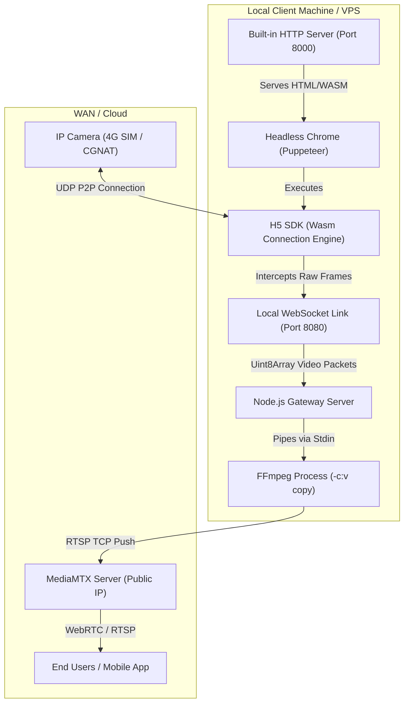

# Warner H5SDK P2P-to-RTSP Stream Gateway

This self-contained Node.js service automates the extraction of high-quality live video streams from cellular/4G SIM-based cameras by utilizing the Warner H5 SDK over P2P, bypassing NAT/CGNAT firewalls, and forwarding the frames as a native RTSP stream to a MediaMTX server.

---

## 1. System Architecture

Cellular cameras connected via 4G SIM cards are behind carrier-grade NAT (CGNAT), making inbound connections (such as directly pulling RTSP from the camera's IP) impossible. Direct camera RTMP push is also limited by firmware defaults (typically locked to sub-streams) and prone to audio track synchronization conflicts.

This gateway bypasses these limits by simulating a user viewing the camera in a browser, extracting the raw digital stream, and pushing it to your streaming server:



### Core Architecture Components:
1. **Built-in HTTP Server:** Serves the static H5 SDK files (Wasm and Javascript decoders) on port `8000`. This removes the need to run an external Python server or configure Nginx.
2. **Headless Chrome (Puppeteer):** Launches a background browser, loads the local page, automatically logs in to the Trueview Cloud portal, fetches the online device list, connects to the target camera via UDP P2P, and triggers the stream.
3. **P2P Frame Interceptor:** Overrides the SDK's internal frame callback (`ConnectApi.onrecvframeex`). When raw Annex B H.264/H.265 video packets are output by the WebAssembly layer, they are intercepted and immediately sent to the Node.js server via WebSockets.
4. **FFmpeg Pipeline:** Ingests raw video packets from the WebSocket, injects wallclock timestamps (`-fflags +genpts -use_wallclock_as_timestamps 1`), and pushes the stream via RTSP using **zero-CPU copy mode** (`-c:v copy`).

---

## 2. Key Features Implemented

* **Built-in Static File Server:** Automatically handles all MIME types (including `.wasm` and `.js`) and serves files directly from the `sdk_dist` directory.
* **Stream Freeze Watchdog:** Cellular networks are prone to temporary dropouts. If the camera stops sending video frames for more than **12 seconds** (without throwing an explicit error), the gateway detects the freeze, terminates the zombie browser, and restarts the connection cycle.
* **Lossless Copying (0% CPU Transcoding):** Video packets are written directly into the RTSP stream. This avoids heavy CPU usage and allows cheap hosting on low-spec VPS servers.
* **Automatic Dialog Handling:** The H5 SDK triggers blocking browser alerts (like "login success!"). The gateway automatically intercepts and accepts these dialogs in the background to prevent thread freezes.

---

## 3. How to Run & Deploy

### Prerequisites
1. **Node.js:** Ensure Node.js (v18+) is installed.
2. **FFmpeg:** Install FFmpeg on the system:
   * **Ubuntu/Linux:** `sudo apt update && sudo apt install -y ffmpeg`
   * **Windows:** (Already installed via `winget Gyan.FFmpeg` on this system).

### Installation
1. Position the directories so that `gateway` and `sdk_dist` are in the same folder:
   ```text
   /your-project/
     ├── sdk_dist/
     └── gateway/
   ```
2. Navigate to the `gateway` folder and install dependencies:
   ```bash
   cd gateway
   npm install
   ```

### Running the Gateway
Start the service in the background:
```bash
node server.js
```
The gateway will log the process in your terminal, showing the WebSocket connection, the initialization of the browser, and the FFmpeg RTSP push.

---

## 4. How to Add a New Camera Tomorrow (No-Hassle Guide)

To stream a different camera or add multiple cameras, follow these guides:

### Programmatic Device Discovery (Retrieve UUID & Secret)
We have included a utility script [`get_devices.js`](file:///d:/Users/chellakkumar/D-Documents/Enarxi/JCB/WARNER_H5SDK_V1/warner_sdk/gateway/get_devices.js) in the `gateway` folder to automatically list all cameras and their credentials registered to your Trueview account.

To find your UUID and Secret programmatically:
1. Run the script from the `gateway/` directory with your Trueview login credentials:
   ```bash
   node get_devices.js info@enarxi.com Enarxi12345@
   ```
2. The script will securely log in to the API, resolve the domain, and print all cameras in your account:
   ```text
   Found 1 device(s) in account:

   [Device #1]
   Name:          Enarxi_Cam1
   Product ID:    2000775769818660864
   Device UUID:   367ABDWN1000346168
   Device Secret: 08ce8ae8a9e468d2313c03c9e058a3c2
   ```

---

### Scenario A: Switching to a Different Camera
Open `server.js` and modify the fields in the `CONFIG` object at the top of the file:
```javascript
const CONFIG = {
  account: "your-login-email@example.com",
  password: "your-login-password",
  deviceId: "NEW_CAMERA_UUID_HERE",
  deviceSecret: "NEW_CAMERA_SECRET_HERE",
  streamUrl: "rtsp://168.144.84.199:8554/live/camera2_hd",
  wsPort: 8080 // Ensure this is free
};
```
Restart the server, and it will connect to the new camera and stream to the new path.

### Scenario B: Running Multiple Cameras Concurrently
If you want to stream **multiple cameras at the same time**, you must run a separate process for each camera. To prevent conflicts, each process must use a **different WebSocket port**.

1. Create a copy of the configuration (e.g. `server_cam2.js`) with:
   * A unique `deviceId` and `deviceSecret`.
   * A unique `streamUrl` (e.g. `/live/camera2_hd`).
   * A unique `wsPort` (e.g. `8081` instead of `8080`).
2. Run both scripts in the background:
   ```bash
   node server.js
   node server_cam2.js
   ```

---

## 5. Summary of the Debugging Journey & Solutions

During development, we resolved several critical issues to ensure the system is stable for production:

1. **Audio Packet Conflict:** MediaMTX was dropping the camera's direct RTMP stream because the camera sent unannounced audio packets. Bypass: Switched to P2P extraction which isolates video frames.
2. **Headless Thread Blocking:** Discovered that H5 SDK browser alert dialogs ("login success") locked Puppeteer. Solution: Added automatic page dialog event listeners in Puppeteer to auto-accept them.
3. **Stream Path Conflicts:** Found that the camera's internal RTMP push client was fighting for the `/live/camera1` path, kicking off our gateway. Solution: Switched the gateway target to `/live/camera1_hd`.
4. **Memory Allocation (malloc) Failure:** Attempting to transcode high-resolution `2304x1296` (3MP) H.265 video to H.264 exceeded memory limitations. Solution: Switched from RTMP to RTSP push (port `8554`) to support native H.265 direct copying (`-c:v copy`), dropping CPU and memory overhead to 0.
